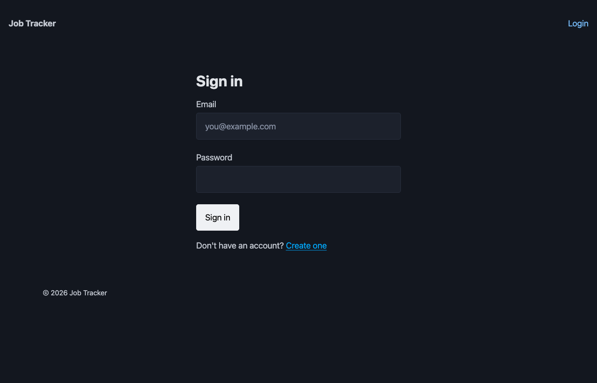
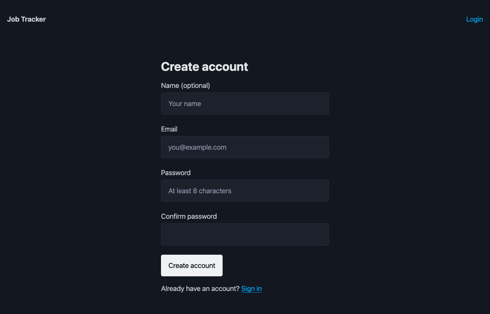
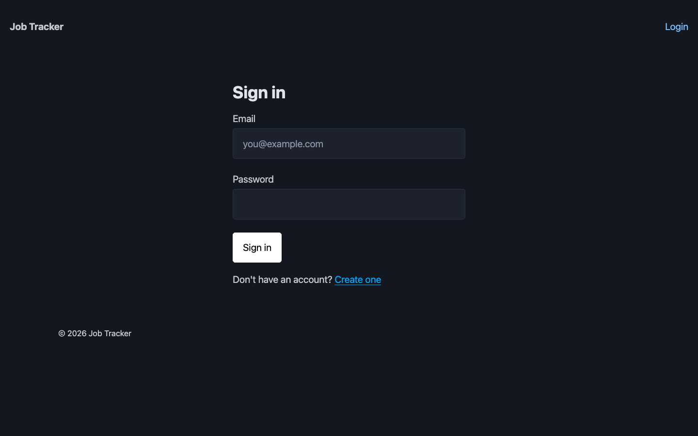
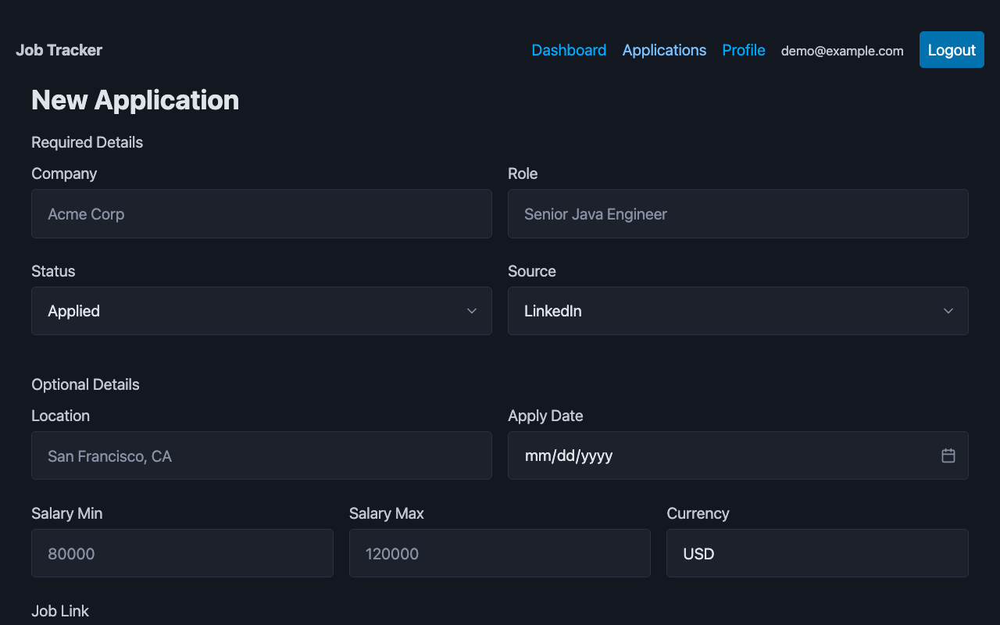

# JobTracker

A full-stack job application tracking platform built with a microservices architecture, event-driven CQRS pattern, and a modern React frontend.

---

## Screenshots

| Login | Register |
|---|---|
|  |  |

| Dashboard (with AI Insights) | Applications |
|---|---|
|  |  |

| Application Detail | New Application |
|---|---|
|  |  |

---

## Tech Stack

**Backend**


**Frontend**


**Infrastructure**


---

## Architecture

JobTracker follows an **event-driven CQRS-like pattern** — writes and reads are handled by separate services, with Kafka as the messaging backbone.

```
                        ┌─────────────────────────────────────────────────────────┐
                        │                     Docker Network                      │
                        │                                                         │
  Browser               │   ┌──────────────────────────────────────────────────┐ │
  :5173  ───────────────┼──▶│              API Gateway  :8080                  │ │
                        │   │         Spring Cloud Gateway (WebFlux)           │ │
                        │   └──────────┬───────────────────┬───────────────────┘ │
                        │              │                   │                      │
                        │   ┌──────────▼──────────┐  ┌────▼──────────────────┐  │
                        │   │  Applications Svc   │  │     Stats Service     │  │
                        │   │     :8081           │  │        :8082          │  │
                        │   │  Spring Boot + JPA  │  │  Spring Boot + JDBC  │  │
                        │   │  JWT Auth + Flyway  │  │  JWT Auth + Ollama   │  │
                        │   └──────────┬──────────┘  └──────┬──────▲─────────┘  │
                        │              │                     │      │             │
                        │   ┌──────────▼──────────┐  ┌──────▼──┐  │             │
                        │   │     PostgreSQL       │  │  Redis  │  │             │
                        │   │     jt_apps :5432   │  │  :6379  │  │             │
                        │   └─────────────────────┘  │ 5m TTL  │  │             │
                        │                            └─────────┘  │             │
                        │                                          │             │
                        │   ┌──────────────────────┐  ┌───────────┴──────────┐  │
                        │   │     PostgreSQL        │  │   Stats Listener     │  │
                        │   │    jt_stats :5432  ◀─────┤      :8083           │  │
                        │   └─────────────────────┘  │  Kafka Consumer      │  │
                        │                            └───────────▲──────────┘  │
                        │   ┌──────────────────────┐             │              │
                        │   │    Apache Kafka       │─────────────┘              │
                        │   │    (KRaft) :9092      │                            │
                        │   └──────────▲───────────┘                            │
                        │              │                                         │
                        │   ┌──────────┴───────────┐  ┌────────────────────────┐ │
                        │   │  OutboxPoller (5s)   │  │   Ollama  :11434       │ │
                        │   │  reads outbox_events │  │  qwen2.5:1.5b          │ │
                        │   │  → publishes to Kafka│  │  ▲ AI Insights (stats) │ │
                        │   └──────────────────────┘  └────────────────────────┘ │
                        │                                                         │
                        │        Config Server :8888  Prometheus :9090            │
                        │        Zipkin        :9411                              │
                        └─────────────────────────────────────────────────────────┘
```

### Services

| Service | Port | Description |
|---|---|---|
| **api-gateway** | 8080 | Single entry point — routes traffic, handles CORS globally |
| **applications-service** | 8081 | Write service — REST CRUD, JPA + Hibernate, publishes Kafka events |
| **stats-service** | 8082 | Read service — analytics from pre-computed agg tables, Redis-cached; serves activity feed |
| **stats-listener** | 8083 | Kafka consumer — two groups: `stats-service` (snapshot/agg) + `activity-service` (activity feed) |
| **config-server** | 8888 | Centralized config for all services (Spring Cloud Config) |
| **PostgreSQL** | 5432 | Two databases: `jt_apps` (write) and `jt_stats` (read) |
| **Kafka** | 9092 | KRaft mode, topic: `application-events`, two consumer groups |
| **Redis** | 6379 | Cache for stats endpoints (5-min TTL) and AI insights (30-min TTL) |
| **Ollama** | 11434 | Local LLM server — serves `qwen2.5:1.5b` for AI insights generation |
| **Prometheus** | 9090 | Scrapes `/actuator/prometheus` from all Spring Boot services |
| **Zipkin** | 9411 | Distributed tracing, 100% sampling |

### Event Flow

1. `applications-service` creates/updates/deletes an application → writes an `ApplicationEvent` row to the `outbox_events` table **in the same DB transaction** as the application save
2. `OutboxPoller` (scheduled every 5s) reads unpublished outbox rows → publishes each to Kafka synchronously → marks `published_at`
3. `stats-listener` consumes events via **two independent consumer groups**:
   - `stats-service` group → upserts into `applications_snapshot`, atomically recomputes `agg_monthly`/`agg_weekly`
   - `activity-service` group → translates each event into a human-readable message, inserts into `activity_feed` (idempotent via unique constraint)
4. `stats-service` queries `agg_monthly` / `agg_weekly` for indexed reads; results are cached in Redis for 5 minutes
5. `GET /v1/stats/activity/{appId}` serves the per-application activity timeline to the frontend

This is the **Transactional Outbox Pattern** — Kafka being down never causes data loss. Events accumulate safely in Postgres and drain automatically when Kafka recovers. The `stats-listener` uses `ON CONFLICT` upserts so duplicate delivery on poller restart is safe.

---

## Features

- **User registration & login** — `POST /v1/auth/register` creates a new account (BCrypt-hashed password, immediate JWT); `POST /v1/auth/token` authenticates existing users; all credentials stored in the `users` table — no hardcoded demo users
- **JWT Authentication** — HS256 token-based auth, enforced by Spring Security on all services; each user sees only their own data
- **Full CRUD** — Create, read, update, and soft-delete job applications with rich fields: apply date, salary range, job link, call received, reject date, resume, login details, notes
- **CSV Import** — Bulk import applications from a spreadsheet export; handles quoted commas, multiple date formats, salary parsing (`$50K`, `50,000–80,000`), and flexible status mapping (`Open` → APPLIED, `Closed` → REJECTED, Open + Call → PHONE)
- **Bulk delete** — Select any number of applications via per-row checkboxes or the select-all header checkbox, then delete them all in one click; deletions are fired in parallel and the list updates immediately
- **Advanced filtering** — Filter applications by status, search (company/role), month, year, and call received; sort by apply date or date added; page-based pagination (20 per page)
- **Activity Feed** — Each Application Detail page shows a live activity timeline. Every create, status update, and deletion is translated into a human-readable message (e.g. "Applied for SWE at Google via LinkedIn", "Status changed to OFFER") and stored in the `activity_feed` table. Powered by Kafka fan-out: a second consumer group (`activity-service`) runs in `stats-listener` alongside the existing `stats-service` group, tracking independent offsets on the same `application-events` topic — no producer changes required. Idempotent via a unique constraint on `(app_id, event_type, occurred_at)`
- **AI Insights** — The Dashboard includes an "AI Insights" card powered by a locally-running LLM (Ollama + `qwen2.5:1.5b`). It aggregates all your stats data (30-day summary, 12-week trend, monthly breakdown, role distribution) and generates 3–5 concise, actionable coaching insights. Responses are cached in Redis for 30 minutes; a Refresh button busts the cache on demand. Fully offline — no API key required
- **Analytics Dashboard** — By Month / By Year toggle with grouped Applied vs Rejected bar chart, summary table, and 7 open-window KPI cards (last 7d / 15d / 30d / 3mo / 6mo / 9mo / 1yr)
- **Pre-computed aggregate tables** — `agg_monthly` and `agg_weekly` in `jt_stats` are maintained in-sync by stats-listener (recomputed atomically on every Kafka event); stats-service reads from these tables with indexed scans instead of live GROUP BY on the raw snapshot
- **Redis caching** — All three stats endpoints (`/summary`, `/trend`, `/breakdown`) are cached in Redis with a 5-minute TTL, keyed per-user; the stats-listener evicts the affected user's cache keys immediately after processing each Kafka event, so the dashboard always reflects the latest data
- **Idempotent writes** — All POST/PATCH endpoints require an `Idempotency-Key` header
- **Soft deletes** — Applications are logically deleted (`deleted_at` timestamp); all queries filter accordingly
- **Transactional Outbox Pattern** — Events are written to `outbox_events` in the same DB transaction as the application save; a scheduled poller publishes them to Kafka, guaranteeing no event loss even if Kafka is temporarily unavailable
- **Event-driven read model** — The stats snapshot is asynchronously kept in sync via Kafka, keeping write and read paths fully decoupled
- **Kafka dead-letter queue** — Failed consumer messages are retried 3x then routed to a DLQ topic
- **Observability** — Structured logging with correlation IDs, Micrometer Prometheus metrics, Zipkin distributed tracing
- **Centralized config** — All Spring Boot services pull runtime configuration from a Config Server on startup
- **Production-ready Docker** — All containers run as non-root, health checks gate startup order, resource limits enforced
- **Schema migrations** — Flyway manages all DB schema; `ddl-auto: validate` prevents accidental drift
- **Input validation** — `@Validated` on all controllers with field-level `@Size`, `@Min/@Max`, `@NotBlank` constraints

---

## API Reference

### Authentication

```
POST /v1/auth/register
Body:     { "email": "you@example.com", "password": "••••••••", "displayName": "Your Name" }
Response: 201 { "token": "eyJ...", "email": "...", "userId": "...", "displayName": "..." }

POST /v1/auth/token
Body:     { "email": "you@example.com", "password": "••••••••" }
Response: 200 { "token": "eyJ...", "email": "...", "userId": "...", "displayName": "..." }
```

Passwords are BCrypt-hashed (strength 10). Emails are normalised to lowercase before storage and lookup. Duplicate email registration returns `409 { "error": "Email already registered" }`. Invalid credentials return `401 { "error": "Invalid credentials" }` (same message for all failure branches to prevent user enumeration).

### Applications

```
GET    /v1/applications?status=APPLIED&search=google&month=4&year=2025&gotCall=true&sortBy=appliedAt&page=0&limit=20
POST   /v1/applications                     (Idempotency-Key header required)
GET    /v1/applications/{id}
PATCH  /v1/applications/{id}                (Idempotency-Key header required)
DELETE /v1/applications/{id}

POST   /v1/applications/import              (multipart/form-data, field: file)

POST   /v1/applications/{id}/notes
PATCH  /v1/applications/{appId}/notes/{noteId}
```

Application statuses: `APPLIED` → `PHONE` → `ONSITE` → `OFFER` → `ACCEPTED / REJECTED / WITHDRAWN`

**CSV import** — the file must have this header row (column order matters):

```
Company,Role,Location,Salary Range,Apply Date,Final Status,Job Link,Resume Uploaded,Call,Reject Date,Login Details,Days pending
```

Response: `{ imported: N, failed: M, errors: ["row 3: ...", ...] }`

### Analytics

```
GET /v1/stats/summary?window=30d
Response: { windowDays, totalApplied, byStatus: {...}, bySource: {...}, generatedAt }

GET /v1/stats/trend?period=week&weeks=12
Response: { period, points: [{ start, end, count }] }

GET /v1/stats/breakdown?groupBy=month&year=2025
GET /v1/stats/breakdown?groupBy=year
Response: {
  groupBy, year,
  rows: [{ label, periodNum, totalApplied, totalRejected, totalOpen }],
  openWindows: { last7d, last15d, last30d, last3m, last6m, last9m, last1y }
}

GET /v1/stats/insights
Response: { insights: ["...", "...", "..."], generatedAt }

GET /v1/stats/activity/{appId}
Response: [{ id, eventType, message, occurredAt }]
```

Swagger UI available at `http://localhost:8081/swagger-ui.html` and `http://localhost:8082/swagger-ui.html`.

---

## Getting Started

### Prerequisites

- Docker & Docker Compose
- Node.js 20+ (for frontend)
- Java 21 + Maven (for running services individually)

### 1. Configure environment

```bash
cd JobTracker/backend
cp .env.example .env
# Edit .env — set DB_PASSWORD and JWT_SECRET (min 32 chars)
```

### 2. Start the backend

```bash
cd JobTracker/backend

# First run — wipe volume so init-db.sql creates the jt_stats database
docker compose down -v
docker compose up --build

# Subsequent runs (no rebuild needed)
docker compose up
```

Docker startup order is automatically enforced:
`postgres + kafka + redis + config-server + ollama` → `applications-service + stats-service + stats-listener + ollama-init` → `api-gateway`

> **First run note:** An `ollama-init` container automatically pulls `qwen2.5:1.5b` (~1GB) on first startup. The AI Insights card shows a graceful fallback message until the download completes. The model is cached in the `ollama_data` Docker volume and is not re-downloaded on subsequent runs.

### 3. Start the frontend

```bash
cd JobTracker/frontend
npm install
npm run dev
# Available at http://localhost:5173
```

### 4. Log in or create an account

Navigate to `http://localhost:5173/register` to create a new account, or sign in at `/login`.

A demo account is pre-seeded: **email:** `demo@example.com` | **password:** `demo`

---

## Project Structure

```
JobTracker/
├── backend/
│   ├── api-gateway/            # Spring Cloud Gateway (WebFlux)
│   ├── applications-service/   # Write service — JPA, Kafka producer
│   ├── stats-service/          # Read service — agg table queries, Redis-cached responses
│   ├── stats-listener/         # Kafka consumer — snapshot upserts + agg table maintenance
│   ├── config-server/          # Spring Cloud Config Server
│   ├── docker-compose.yml      # Full infrastructure definition
│   ├── init-db.sql             # Creates jt_stats DB (runs on fresh volume)
│   ├── prometheus.yml          # Prometheus scrape config
│   ├── .env.example            # Required environment variables
│   └── .gitignore
└── frontend/
    ├── src/
    │   ├── api/                # Axios clients + typed API functions
    │   ├── auth/               # AuthContext + RequireAuth route guard
    │   ├── routes/             # Login, Register, Dashboard, Applications, Detail, Profile
    │   └── main.tsx            # App entry + ErrorBoundary
    ├── .env                    # Local dev environment variables
    └── package.json
```

---

## Database Schema

**`jt_apps`** (write database)

- `users` — registered users with BCrypt-hashed passwords and optional display name
- `applications` — job applications with JSONB tags, salary range, soft-delete, and extended fields: `applied_at`, `job_link`, `resume_uploaded`, `got_call`, `reject_date`, `login_details`
- `application_status_history` — full audit trail of status transitions
- `application_notes` — notes per application
- `outbox_events` — transactional outbox; events written here atomically with application mutations, polled and published to Kafka every 5s

**`jt_stats`** (read database)

- `applications_snapshot` — denormalized projection of applications, kept in sync via Kafka; includes `applied_at` for accurate date-based analytics
- `agg_monthly` — pre-computed application counts keyed by `(user_id, year, month, status)`; updated atomically on every Kafka event; enables `breakdown` and month-level open-window queries with a single indexed scan
- `agg_weekly` — pre-computed weekly counts keyed by `(user_id, week_start)`; updated atomically on every Kafka event; enables `trend` queries with a fast indexed range scan
- `activity_feed` — per-application event timeline; one row per Kafka event, translated to a human-readable message; idempotent via unique constraint on `(app_id, event_type, occurred_at)`

All schema changes are managed by Flyway migrations (`ddl-auto: validate`).

---

## Configuration

All Spring Boot services pull their runtime config from the Config Server at startup. Config files live in:

```
backend/config-server/src/main/resources/config-repo/
├── applications-service.yml
├── stats-service.yml
├── stats-listener.yml
└── api-gateway.yml
```

Secrets (DB password, JWT secret) are supplied via `backend/.env` and injected as environment variables into Docker containers — never committed to source control.

---

## Running Individual Services

```bash
# From any service directory (requires local Postgres + Kafka)
mvn spring-boot:run

# Build and test
mvn clean install

# Single test class
mvn test -Dtest=ApplicationsServiceTest
```

---

## Observability

| Tool | URL | Description |
|---|---|---|
| Prometheus | http://localhost:9090 | Metrics for all Spring Boot services |
| Zipkin | http://localhost:9411 | Distributed trace viewer |
| Actuator (apps) | http://localhost:8081/actuator | Health, metrics, Prometheus endpoint |
| Actuator (stats) | http://localhost:8082/actuator | Health, metrics, Prometheus endpoint |

Custom Micrometer counters: `applications.created.total`, `applications.deleted.total`, `stats.queries.total`

All services emit structured logs with a `correlationId` and `traceId` included in every log line.
